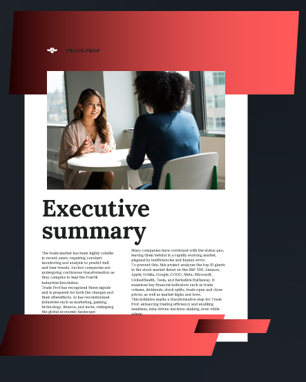
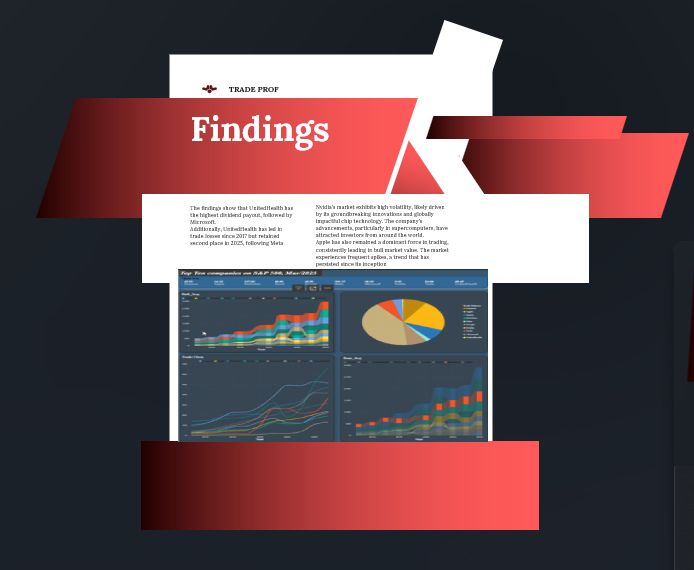

# Algorithmic Trading with PPO — Backend
---

## Quick project summary (what the service does)

* Trains an **autonomous trading agent** using **Proximal Policy Optimization (PPO)** to make buy/sell/hold decisions for the Top-10 S\&P 500 tickers (Mar/2025 snapshot).
* Provides scheduled data ingestion, training, and an **inference REST API** for real-time or paper trading.
* Produces evaluation CSVs and visual assets that are consumed by Power BI to generate the PowerPoint-style project summary.

---

## What the presentation pages contain (visual interpretation)

* **Cover (Financial Insights)** — stylized cover with title, date, and branding; used as the executive summary slide in exported PPTX.
* **Executive summary** — short narrative of objective, approach, and key results; includes a small metric table and a visual.
* **Conclusion / Training snapshot** — terminal-like training log and final model status; includes recommended next steps.

The presentation images are available in `presentation/` and were exported from Power BI or assembled from report screenshots.

---

## Tools & technologies (backend focus)

**Primary runtime & infra**

* Python 3.12+ (core logic, training, API)
* Power BI

**Key Python libraries**

* `pandas`, `numpy` — data handling
* `yfinance` — market data
* `Request` — API action
* `gym` / custom trading env — environment interface
* `stable-baselines3` (or `torch` + custom PPO) — training algorithm
* `scikit-learn` — preprocessing
* `matplotlib`/`plotly` — charts for evaluation

---
Slide 1 — Cover: FINANCIAL INSIGHTS
----------------------------------

Contents:
- Title: FINANCIAL INSIGHTS
- Date: 10/03/2025
- Branding: TRADE PROF
- Prepared for: elites
- Decorative: grayscale skyline image; red gradient header and footer bars

____

Slide 2 — Executive summary
---------------------------

Contents:
- Heading: Executive summary
- Short narrative describing:
  - Problem: market volatility and need for automated decision-making
  - Approach: PPO-based Deep RL agent trained on top-10 S&P 500 tickers
  - Data: historical market data + technical features
  - Evaluation: cumulative returns, Sharpe ratio, drawdown

Source files to reproduce content:
- notebooks/Top_10_SP500_Mar2025.ipynb  (data fetch & preprocessing)
- notebooks/train_ppo.ipynb             (training run & logs)
- scripts/evaluate.py                   (produces metrics CSVs for Power BI)

Slide 2 — Findings
----------------------------------------

Contents:
- Heading: Findings
- Short paragraphs of findings
- Power BI snapshot: charts: Avg (Bull (waterfall), bear (waterfall), Close (line), Open (card), Volueme (pie) )

The findings show that UnitedHealth has the highest dividend payout, followed by Microsoft. 
Additionally, UnitedHealth has led in trade losses since 2017 but retained second place in 2025, following Meta

Nvidia's market exhibits high volatility, likely driven by its groundbreaking innovations and globally impactful chip technology. The company's advancements, particularly in supercomputers, have attracted investors from around the world.
Apple has also remained a dominant force in trading, consistently leading in bull market value. The market experiences frequent spikes, a trend that has persisted since its inception

____

Slide 3 — Conclusion & Training snapshot
----------------------------------------
File: presentation/Screenshot 2025-08-27 140548.png

Contents:
- Heading: Conclusion
- Training log snapshot: key counters and hyperparameters (FPS, iterations, total_timesteps, learning_rate, clip_range, loss values)
- Short conclusion paragraph and recommended next steps

These market values are essential considerations when making trade decisions, as the data comes from reliable sources and is drawn from the inception of each company.

Regarding decision-making, Trade Prof has equipped AI engineers, data scientists, and engineers with the tools to develop an agentic AI model for algorithmic trading. This AI-driven approach enables automated trading based on historical patterns and market trends, enhancing efficiency and precision in financial decision-making.

This data has been trained, tested, and is ready for deployment to ensure optimal trading accuracy, continuous AI learning, and efficient market predictions.
The model was developed using Deep Reinforcement Learning, which has demonstrated superior forecasting capabilities compared to other AI approaches. Proximal Policy Optimization (PPO) served as the primary training method, enhancing the model’s adaptability and decision-making in dynamic market conditions

